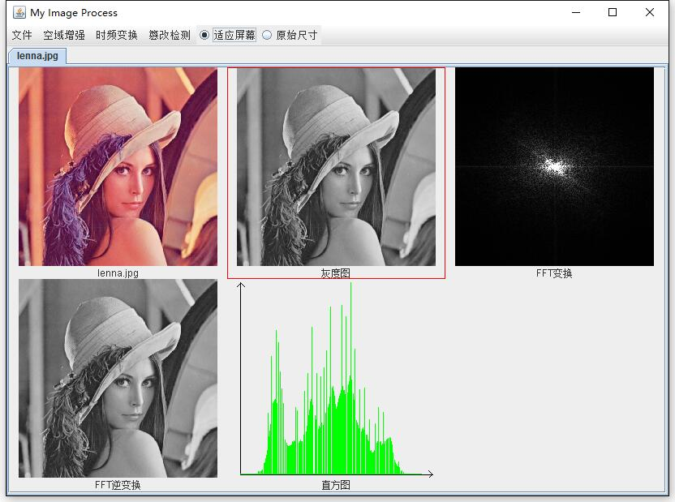
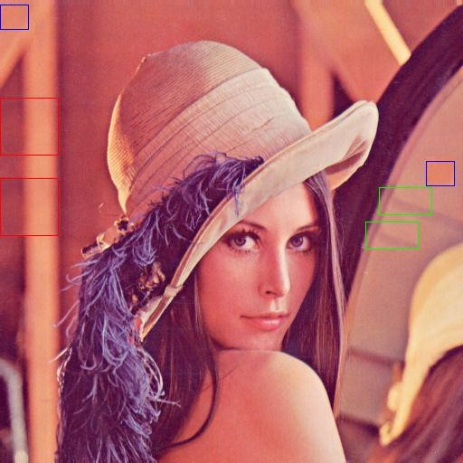

# 我的图像处理小工具
* 开发语言：Java
* 环境：Eclipse+WindowBuilder

  
**拷贝篡改检测示例**：通过ps复制多于一处的区域并移动到不同的地方，原始块和复制快用同一种颜色标出来。程序都成功检测出来了。

## 1.介绍
这是一个图像处理课程的作业，可以执行以下操作：

1. 空域增强
	* 灰度化
	* 直方图
	* 均衡化
	* 线性变换
2. 时频变换
	* DFT（离散傅里叶变换）
	* FFT（快速傅里叶变换）
	* DCT（离散余弦变换）
3. 篡改检测
	* 拷贝移动

## 2.说明
* DFT和DCT是按照公式实现的，所以会很慢，不要以为程序死掉了。
* 拷贝篡改（copy and move image forgeries）检测所用的算法比较简单：采用穷举所有相似块的暴力方法找到那些可能是通过复制得到的块，块的大小是8X8，或者其他，但不能太小。用块中的左上角的坐标来标志一个块，第一块是（0,0），第二块是（1,0）…，下一行的第一块是（0,1）而不是（0,8）。两个块相似的条件是这两个块中的64个像素点的灰度均相同，一直这样遍历得到所有重复的块，这些重复的块中记录着原始块的坐标（左上角像素的坐标），从而可以求得该块移动的距离和斜率。再将这些块中斜率和距离相同的分成一组，每一组即对应一块复制粘贴区。考虑到一些干扰因素还需要进行过滤，对每一组数量少于某个阈值以及移动距离小于某个阈值的组忽略掉。最后将这些复制粘贴区域用不同的颜色框出来。
* 界面开发采用Swing/AWT，其中Swing是一种轻量级的UI库，依赖于AWT。现在比较流行SWT，因为Swing/AWT是完全从底层开始自己“手绘”界面的，这也就导致了速度比较慢。而SWT是调用操作系统完成图形界面的绘制，因此，代码不改变的情况下在不同的系统上呈现出不同的风格。

## 3.主要功能
* 图片的位置自适应
* 支持多个 图(面)片(板) 同时操作
* 部分快捷键（打开/关闭图片）
* 支持显示原图和适应屏幕两种缩放
* 可以选中某个图片右键进行保存或移除

#### 已知的问题
* 适应屏幕某些情况会失灵
* 使用RGB彩色图像作为输入，FFT逆变换得到的灰度图和原灰度图有微小的差别

#### ToDo
* 图片拖拽打开
* 更多的图片处理功能...